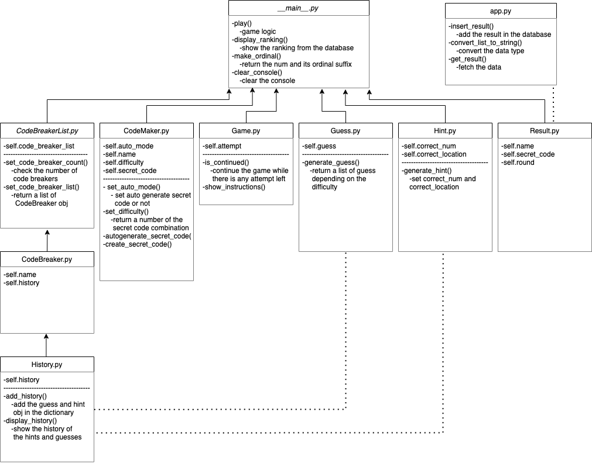

<h1>Mastermind Game</h1>

<h2>Required Technology</h2>

Python3 - 

Git - 


<h2>How to Play</h2>
<p>1. Clone this repository</p>

```
git clone git@github.com:reitoserizawa/mastermind-game.git
```

<p>2. Run Python scripts for the 'mastermind-game-oop' folder</p>

```
python3 mastermind-game-oop
```

<p>3. Enjoy the game!</p>


<h2>Class/Database Diagram</h2>


<h2>File Hierarchy</h2>


<h2>Project Buildng Process</h2>
<p>Editing...</p>

<h2>Extensions</h2>
<p>Editing...</p>

