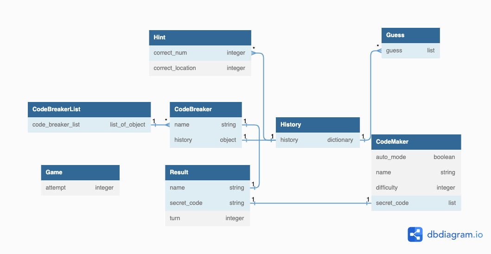

<h1>Mastermind Game</h1>
<p>This is Mastermind Game created by Python3 and SQLite. This game is for code breakers to guess the number combination of the secret code created by a code maker. You can play against the computer or friends. Code breakers have 10 attempts to guess the secret code.</p>

<h2>Required Technology</h2>

<p>Language: Python3</p>
<p>OS: macOS, Linux or Windows</p>
<p>Other: Git (to clone this repo)</p>


<h2>How to Play</h2>
<p>1. Clone this repository</p>

```
git clone git@github.com:reitoserizawa/mastermind-game.git
```

<p>2. Run Python scripts for the 'mastermind-game-oop' folder</p>

```
python3 mastermind-game-oop
```

<p>3. Enjoy the game!</p>


<h2>Class/Database Diagram</h2>


<h2>File Hierarchy</h2>


<h2>Extensions</h2>
<ul>
  <li>"Computer" mode and "Friends" mode</li>
  <p>Play against the computer's code or a code created by the friend</p>
  <li>Multi-player</li>
  <p>"Computer" mode allows max 4 players and "Friends" mode does from 2 to 4 players (one of them is a code maker)</p>
  <li>Difficulty Level</li>
  <p>"Easy" is with 4 numbers of the secret code, "Medium" is with 5 numbers, and "Hard" is with 6 numbers</p>
  <li>Result and Ranking</li>
  <p>Show the winner of the game as a result</p>
  <p>If a code breaker wins the game, the result is stored in the database</p>
  <p>The result data is fetched from the database and shown based on how many turns they took to guess the secret code</p>
  <li>Personalization</li>
  <p>Each player can add their name</p>
  <li>Error Handling</h1>
  <p>Any used input is handled if it is not a value asked</p>
  <li>OS Adaptability</h1>
  <p>Linux, Mac, and Windows (implemented to clear the console)</p>
</ul>

